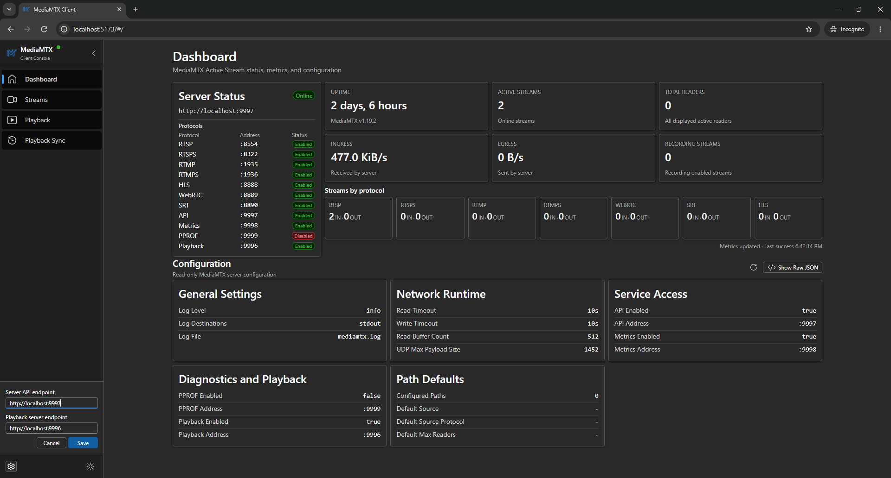
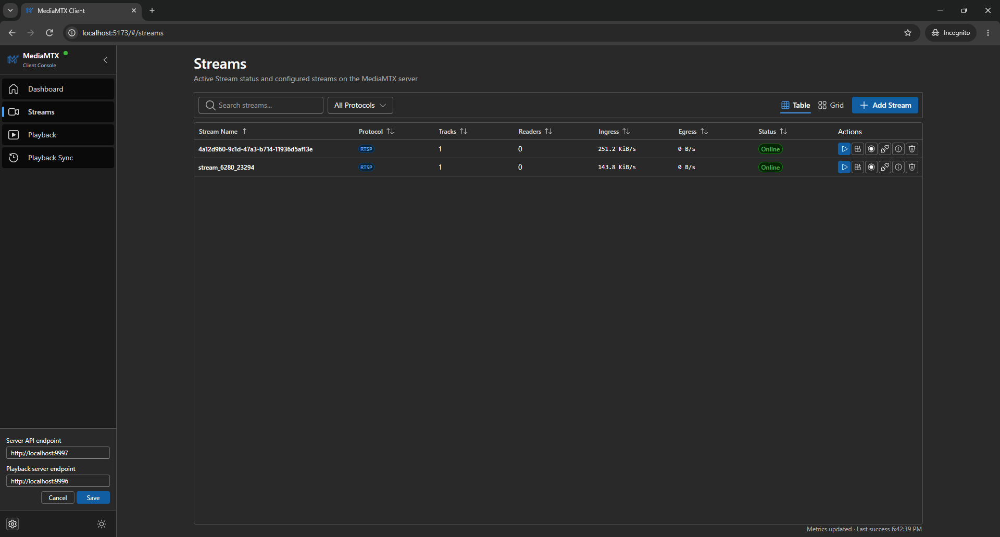
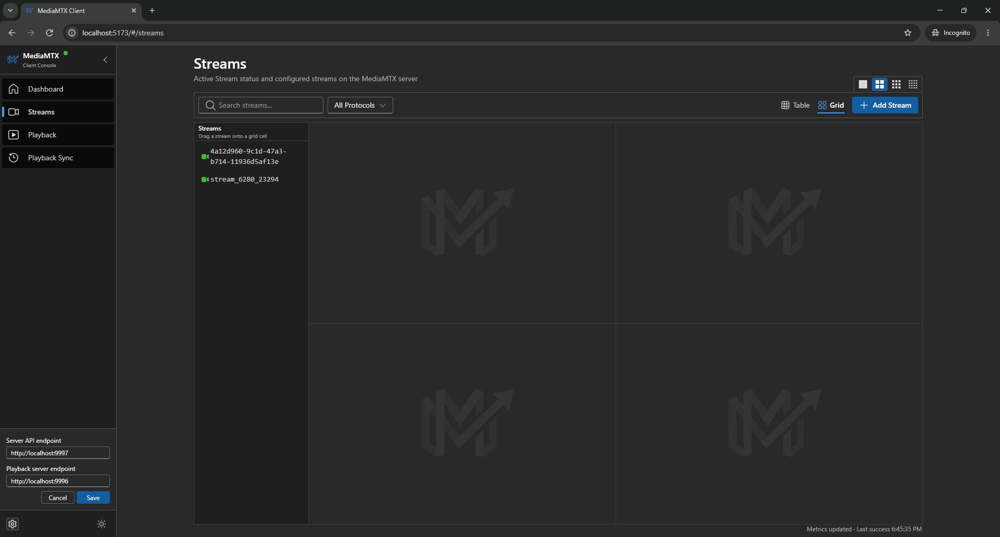
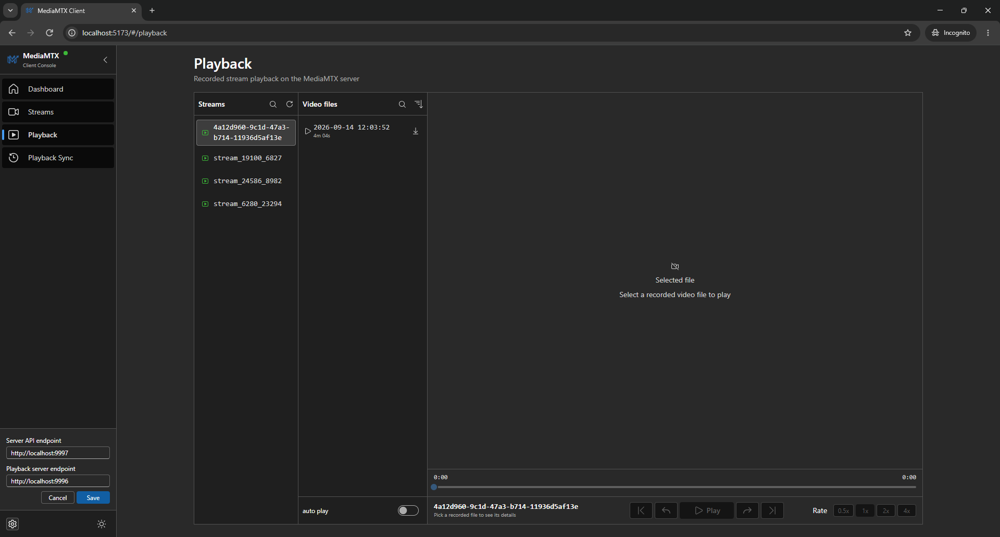
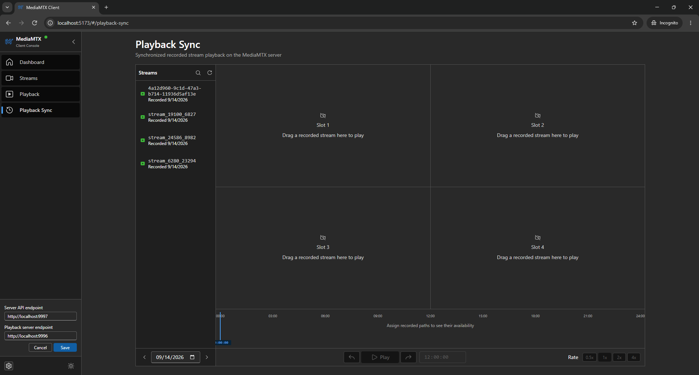

# MediaMTX Client

MediaMTX Client is a browser-based management console for a [MediaMTX](https://mediamtx.org/) live media server and media proxy. It provides server health monitoring, live metrics inspection, configuration review, stream management, live video playback, recorded file review, and synchronized playback across multiple cameras.

There is no need to install any software to use it. The application is accessible directly on GitHub Pages at https://minchansike.github.io/mediamtx-client or by opening `dist/index.html` locally in any web browser. No metadata is collected, and there are no strings attached. Everything runs entirely in the browser and communicates directly with the MediaMTX server.

This project also demonstrates a practical AI-assisted development process. Almost all the code was produced by AI agents, followed by manual code review. The work used AI-agent workflows, prompt engineering, media domain knowledge, and development tools to guide the agents, check output, improve implementation decisions, and turn media operations requirements into a functional interface.

## Screenshots











## Architecture

The application is a browser-only Vite, React, and TypeScript client. It communicates directly with configured MediaMTX API and playback server endpoints. There is no backend service, and no user metadata or telemetry is collected.

Application state is split across small Zustand stores. These stores manage app preferences, dashboard metrics, player assignments, recorded file playback, timeline synchronization, and MediaMTX API resources. API hooks fetch server info, paths, global config, raw config, path details, viewer lists, and recording segments. Live paths and server info refresh every 3000 ms while visible, and refresh automatically when returning to the browser tab. Global configuration loads on entry, explicit refresh, and relevant updates. Path configuration metadata is fetched alongside runtime paths.

The user interface provides four main views: Dashboard, Streams, Playback, and Playback Sync. The production build uses `vite-plugin-singlefile`, bundling the entire application into one portable `index.html` file that runs from anywhere without a local web server.

## Technology Stack

- React 18 and TypeScript
- Vite 6
- Bun for dependency install, scripts, and tests
- Microsoft Fluent UI React components and Fluent UI icons
- Zustand for UI preferences, API resource state, dashboard metrics, and player state
- HTML5 video and `hls.js` for browser playback with WebRTC and HLS fallback
- Zod for stream and MediaMTX API response validation
- Atlaskit pragmatic drag-and-drop for live grid and playback sync slot assignment
- Tailwind CSS and PostCSS for app styling
- ESLint, Prettier, and TypeScript project references for development checks
- `vite-plugin-singlefile` for portable single-file builds

## Project Structure

```text
.
|-- dist/
|   `-- index.html           Portable single-file application
|-- docs/
|   |-- mediamtx-api.http    MediaMTX API request examples
|   `-- mediamtx-openapi.yaml
|-- screenshots/             Application screenshots
|-- src/
|   |-- api/                 MediaMTX API and playback request helpers
|   |-- assets/              Icons and image assets
|   |-- components/
|   |   |-- common/          Shared UI primitives and buttons
|   |   |-- config/          Configuration summary and raw JSON views
|   |   |-- dashboard/       Server status and dashboard metrics
|   |   |-- layout/          Sidebar, header, and theme controls
|   |   |-- playback/        Recorded file player, file list, and seek bar
|   |   |-- playbackSync/    Multi-stream sync grid, controls, and timeline
|   |   `-- streams/         Stream tables, cards, drawers, players, and grid
|   |-- hooks/               API, mutation, metrics, and playback hooks
|   |-- pages/               Dashboard, Streams, Playback, and Playback Sync pages
|   |-- playbackSync/        Shared clock and multi-stream sync controller
|   |-- router/              Route definitions and path helpers
|   |-- schemas/             Zod schemas for config and path data
|   |-- store/               Zustand stores for state management
|   |-- styles/              Global CSS and Tailwind layers
|   |-- types/               Shared TypeScript types
|   `-- utils/               Formatting, protocol, status, and time helpers
|-- tests/                   Bun unit and component-behavior tests
|-- package.json
|-- bun.lock
`-- vite.config.ts
```

## Setup And Run

Users do not need to install any software to use MediaMTX Client. Access the application directly at https://minchansike.github.io/mediamtx-client or double-click `dist/index.html` locally in any web browser. No metadata is collected, and there are no strings attached.

### MediaMTX Server Requirements

Start a MediaMTX server with the API enabled. The default endpoints used by the client are:

- Control API: `http://localhost:9997`
- Playback Server: `http://localhost:9996`

Both endpoints can be adjusted at any time by clicking the settings gear icon in the sidebar. Because the browser communicates directly with MediaMTX, the server endpoints must be accessible from the browser. If cross-origin requests are blocked, ensure the MediaMTX configuration allows API access.

### Local Development

To build or modify the project from source, install Bun first. This repository includes `bun.lock`, so install dependencies with:

```bash
bun install --frozen-lockfile
```

Run the development server:

```bash
bun run dev
```

Build the portable single-file application:

```bash
bun run build
```

Preview the production build:

```bash
bun run preview
```

Run the quality checks:

```bash
bun run test
bun run typecheck
bun run lint
```

The main development checks for this repository are:

```bash
bun run typecheck
bun run lint
bun run build
```

## Tests

The repository includes Bun tests covering:

- User preferences and theme persistence
- Server uptime calculations and API connection status
- Runtime dependencies and router base paths
- Configuration summary rendering and raw configuration toggling
- Playback URL generation for WebRTC, HLS, RTSP, RTMP, and SRT
- Stream details drawer actions
- Single-player drawer behavior and video sizing
- Stream editing, deletion, and protocol validation
- Live drag-and-drop grid layouts and player refresh logic
- Transfer rate calculations and metric formatting
- Recorded file playback, file formatting, and player store behavior
- Playback sync grid, timeline lanes, day navigation, and slot assignment
- Multi-stream shared clock synchronization controller
- Recording toggle actions, status badges, and table column layouts
- Close button interactions and hover states

## Implemented Features

### Application Shell

- Editable MediaMTX API endpoint (default is `http://localhost:9997`).
- Editable MediaMTX playback server endpoint (default is `http://localhost:9996` or derived from server configuration).
- Live API connection indicator based on the configured endpoint.
- Fluent UI light and dark themes, saved in browser preferences.
- Collapsible sidebar with navigation across Dashboard, Streams, Playback, and Playback Sync.

### Dashboard

- Server status card with active API endpoint and protocol listener addresses.
- Server and stream metrics: uptime, online streams, recording streams, ingress and egress transfer rates, and total readers.
- Reader counts grouped by protocol, collapsed by default.
- Last successful metrics refresh time with explicit stale and unavailable indicators.
- MediaMTX configuration summary grouped into general, network, service access, diagnostics, playback, and path default sections.
- Raw configuration JSON drawer loaded on demand directly from the MediaMTX API.
- Clear loading and error states for dashboard API data.

### Streams Workspace

- Search and protocol filters for finding streams quickly.
- Table, and multi-player grid views.
- Sortable stream table with status, protocol, track count, reader count, recording status, ingress and egress rates, and stream actions.
- Recording status badges displaying whether a stream is actively recording.
- Start and stop recording buttons for online streams with confirmation dialogs.
- Card view actions for playback, grid assignment, details, edit, delete, reader inspection, and source kick where available.
- Add stream drawer with protocol detection, stream name input, source URI validation, and MediaMTX path creation.
- Edit and delete flows for configured streams.
- Stream details drawer with source details, track configurations, active readers, and generated playback URLs.
- Active readers and viewer details drawers for connected clients.
- Multi-player live grid with 1x1, 2x2, 3x3, and 4x4 layouts plus drag-and-drop stream assignment.

### Live Stream Playback

- Browser playback starts with WebRTC WHEP for ultra-low latency.
- Automatic fallback to HLS if WebRTC setup fails or times out.
- HLS playback uses native browser HLS where available and `hls.js` otherwise.
- Single-player drawer for quick live monitoring without leaving the stream list.
- Generated playback URLs for WebRTC WHEP, HLS, RTSP, RTMP, and SRT formats based on the configured MediaMTX host and listener ports.

### Recorded File Playback

- Dedicated playback page for browsing and watching recorded video files.
- Stream selector listing recorded paths with active recording indicators.
- Quick toggle to start or stop recording for any selected stream.
- File list displaying recorded segments with start time, duration, and file size.
- Video viewer with custom seek bar, play and pause controls, and time displays.
- Playback rate selection (0.5x, 1x, 1.5x, 2x) for faster or slower review.
- Autoplay option that automatically advances to the next chronological file.
- Direct MP4 download option to save recording files to local disk.
- Helpful status messages when the playback service is disabled or unreachable.

### Synchronized Multi-Stream Playback

- Playback sync workspace for reviewing multiple recorded streams side by side.
- Flexible grid layouts for up to four streams, featuring drag-and-drop catalog assignment.
- Calendar day selector to browse recorded footage across different dates.
- Interactive multi-track timeline showing recording intervals for all active stream slots.
- Synchronized playback controller with a shared clock to keep all video slots in lockstep.
- Timeline scrubbing that seeks all active streams simultaneously to the exact same point in time.
- Unified play, pause, and time tracking across every active slot.

### Transfer Rates

Dashboard, table, cards, stream details, and the single-player drawer share one in-memory rate sample per path. Ingress is received by MediaMTX, and egress is sent by MediaMTX. Rates use counter deltas divided by the measured elapsed time, normally around three seconds, formatted as B/s, KiB/s, or MiB/s. They are interval averages, not instantaneous bitrate measurements.

Modern `inboundBytes`/`outboundBytes` counters take precedence over legacy aliases. Raw counters remain unchanged. The first sample, missing counters, counter resets, lifecycle changes, and failed requests display an unavailable dash. Unchanged valid counters display `0 B/s`. Samples expire after six seconds, and recovery needs two fresh samples. Dashboard rates sum individual path rates and indicate partial coverage while samples are missing.

### Limitations

MediaMTX v1.19.2 does not automatically save API-driven configuration changes to its `mediamtx.yml` config file. For that reason, this browser client focuses on viewing configuration, playing live streams, reviewing recorded footage, and managing runtime paths. It does not manage server configuration files directly.

Authentication is not implemented yet. It is planned for a future release.

### TODO

- [ ] Add Docker support for running the client.
- [ ] Added Docker Compose support for running the MediaMTX server with the client.
- [ ] Provide a prebuilt executable or packaged desktop app.
- [ ] Add authentication support for secured MediaMTX API endpoints.

## Contributions

Feedback is welcome, especially from people using the client with real MediaMTX setups.
Testing notes are very helpful across different browsers, protocols, and server configurations.
Usability feedback, stream workflow feedback, and deployment feedback help guide what should improve next.
Feature requests are easiest to act on when they include the use case and the expected behavior.
Focused pull requests are appreciated.
