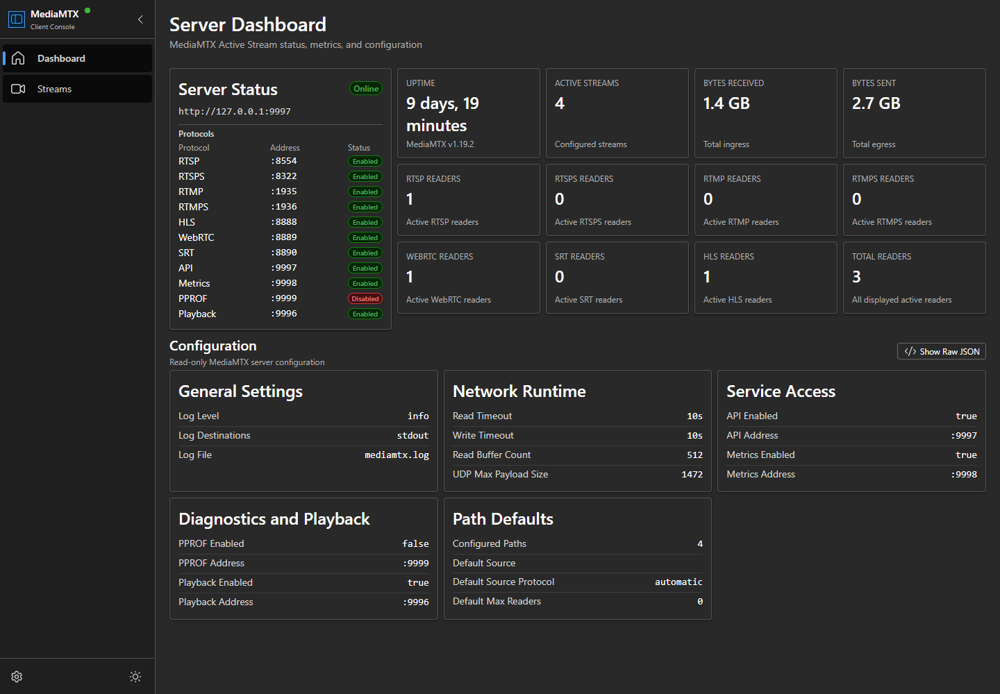
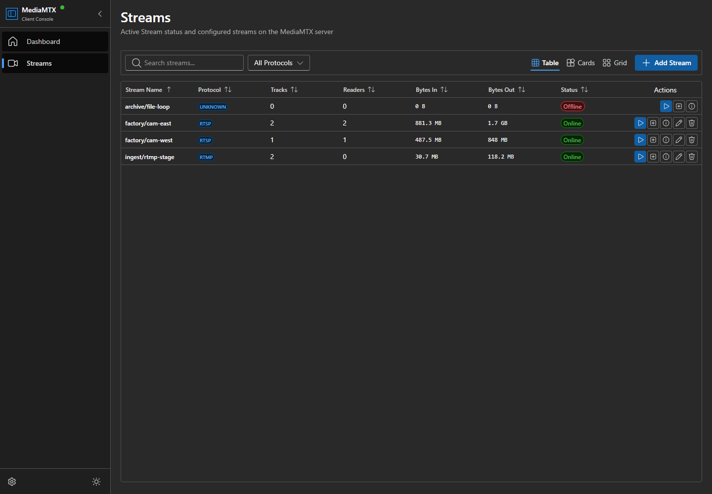
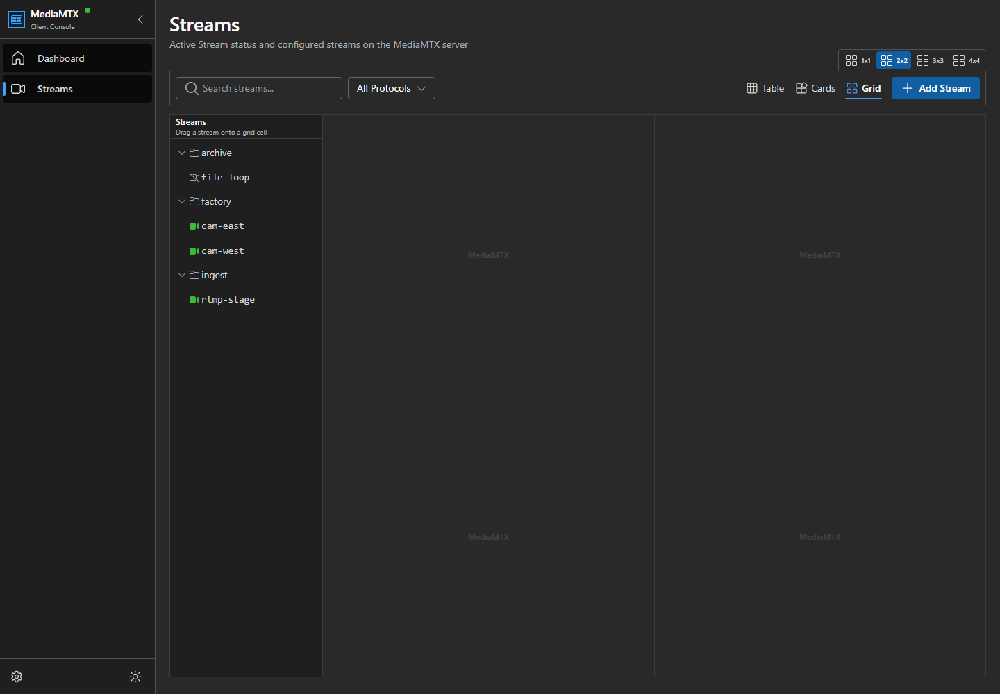
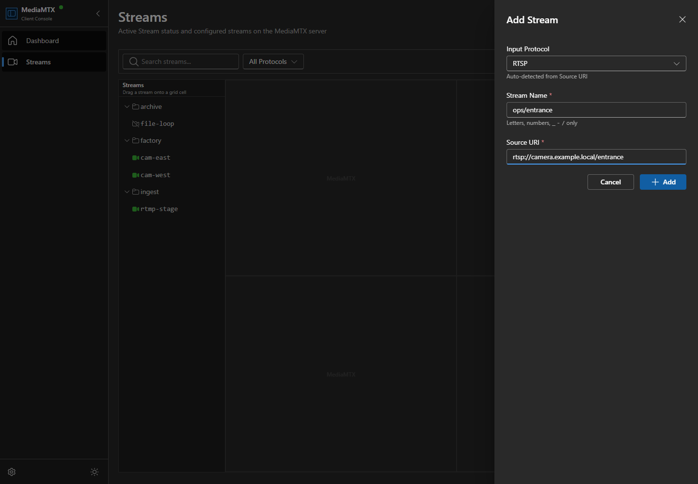

# MediaMTX Client

MediaMTX Client is a browser-based management console for a [MediaMTX](https://mediamtx.org/) live media server and media proxy. It helps you check server health, view live metrics, read configuration, manage streams, and play live streams.

This project also shows a practical AI-assisted development process. Almost all code was produced with AI agents, with less than 1% written manually. The work used AI-agent workflows, prompt engineering, media domain knowledge, and development tools to guide the agents, check their output, improve implementation decisions, and turn media operations requirements into a functional interface.

## Screenshots









## Architecture

The application is a browser-only Vite, React, and TypeScript client. It talks directly to the configured MediaMTX API base URL. This repository does not include a backend service.

State is split across small Zustand stores. These stores handle app preferences, dashboard metrics, player assignments, and MediaMTX API data. API hooks load server info, paths, global config, raw config, path details, viewer details, and stream changes. Live paths, server info, and global config refresh every 3000 ms while they are being used.

The UI has one main app shell with Dashboard and Streams pages. The production build uses `vite-plugin-singlefile`, so the app can be shipped as one portable `index.html` file.

## Technology Stack

- React 18 and TypeScript
- Vite 6
- Bun for dependency install, scripts, and tests
- Microsoft Fluent UI React components and Fluent UI icons
- Zustand for UI preferences, API resource state, dashboard metrics, and player state
- `hls.js` for browser HLS fallback playback
- Zod-backed stream and MediaMTX response validation
- Atlaskit pragmatic drag-and-drop for grid stream assignment
- Tailwind CSS and PostCSS for app styling
- ESLint, Prettier, and TypeScript project references for development checks
- `vite-plugin-singlefile` for portable single-file builds

## Project Structure

```text
.
|-- docs/
|   |-- mediamtx-openapi.yaml
|   `-- screenshots/
|-- src/
|   |-- api/                 MediaMTX API request helpers
|   |-- components/
|   |   |-- common/          Shared UI primitives
|   |   |-- config/          Configuration summary and raw JSON views
|   |   |-- dashboard/       Server status and dashboard metrics
|   |   |-- layout/          Sidebar, shell, and theme controls
|   |   `-- streams/         Stream tables, cards, drawers, players, and grid
|   |-- hooks/               API, mutation, metrics, and playback hooks
|   |-- pages/               Dashboard and Streams pages
|   |-- schemas/             Zod schemas for config and path data
|   |-- styles/              Global CSS and Tailwind layers
|   |-- store/               Zustand stores
|   |-- types/               Shared TypeScript types
|   `-- utils/               Formatting, protocol, status, and stream helpers
|-- tests/                   Bun unit and component-behavior tests
|-- package.json
|-- bun.lock
`-- vite.config.ts
```

## Setup And Run

Install Bun before you run the project commands. This repository includes `bun.lock`, so install dependencies with Bun:

```bash
bun install --frozen-lockfile
```

Start a MediaMTX server with the API enabled. The browser must be able to reach the API. The app uses this default URL:

```text
http://localhost:9997
```

You can change the endpoint from the sidebar while the app is running. Because the browser calls the MediaMTX API directly, the API must be reachable from the same browser environment.

Run the development server:

```bash
bun run dev
```

Build the application:

```bash
bun run build
```

Preview the production build:

```bash
bun run preview
```

Run the quality checks:

```bash
bun run test
bun run typecheck
bun run lint
```

The main development checks for this repository are:

```bash
bun run typecheck
bun run lint
bun run build
```

## Tests

The repository includes Bun tests for user preferences, uptime calculation, dashboard API status, runtime dependencies, raw configuration toggling, playback URL generation, API store behavior, stream details, stream card actions, single-player drawer behavior, edit stream behavior, drag-and-drop grid behavior, config summary rendering, and add stream protocol handling.

## Implemented Features

### Application Shell

- Editable MediaMTX API endpoint. The default is `http://localhost:9997`.
- API status indicator based on the configured MediaMTX endpoint.
- Fluent UI light and dark themes. The selected theme is saved in browser preferences.
- Tab-style page switching managed by app state.
- Collapsible sidebar with Dashboard and Streams navigation.

### Dashboard

- Server status card with the active API endpoint and protocol listener addresses.
- Server and stream metrics, including uptime, active streams, byte totals, and active reader counts by protocol.
- MediaMTX configuration summary grouped into general, network, service access, diagnostics, playback, and path default sections.
- Raw configuration JSON drawer loaded on demand from the MediaMTX API.
- Loading and error states for dashboard API data.

### Streams Workspace

- Search and protocol filters for streams.
- Table, card, and multi-player grid views.
- Sortable stream table with status, protocol, track count, reader count, byte totals, and stream actions.
- Card view actions for playback, grid assignment, details, edit, delete, reader inspection, and source kick where available.
- Add stream drawer with protocol selection, source URI detection, validation, and MediaMTX path creation.
- Edit and delete flows for configured streams.
- Stream details drawer with source details, track details, active readers, and generated playback URLs.
- Active readers and viewer details drawers for supported MediaMTX reader resources.
- Single-player drawer playback.
- Multi-player grid with `1x1`, `2x2`, `3x3`, and `4x4` layouts plus drag-and-drop stream assignment.

### Live Stream Playback

- Browser playback starts with WebRTC WHEP.
- If WebRTC setup fails or times out, playback falls back to HLS.
- HLS playback uses native browser HLS where available and `hls.js` otherwise.
- Generated playback URLs include WebRTC WHEP, HLS, RTSP, RTMP, and SRT formats based on the configured MediaMTX host and listener ports.

### Limitations

MediaMTX v1.19.2 does not automatically save API-driven configuration changes to its `mediamtx.yml` config file. For that reason, this browser client focuses on viewing configuration, playing live streams, and showing stream details. It does not manage server configuration files.

Authentication is not implemented yet. It is planned for a future version.

### TODO

- [ ] Add Docker support for running the client.
- [ ] Add Docker Compose support for running MediaMTX with the client.
- [ ] Provide a prebuilt executable or packaged desktop app.
- [ ] Add live stream recording.
- [ ] Add playback for recorded video files.

## Contributions

Feedback is welcome, especially from people using the client with real MediaMTX setups.
Testing notes are very helpful across different browsers, protocols, and server configurations.
Usability feedback, stream workflow feedback, and deployment feedback help guide what should improve next.
Feature requests are easiest to act on when they include the use case and the expected behavior.
Focused pull requests are appreciated. Tests are a big help when a change affects existing behavior.
